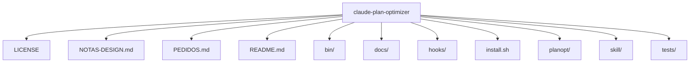
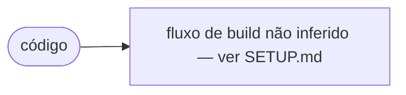

# Architecture — claude-plan-optimizer

## Overview

Picks the right model at the right reasoning effort for the task in front of it, so the strongest model stops being spent on changing a colour.

## Stack (extraído do repositório)

| Camada | Tecnologia | Versão / nota |
| --- | --- | --- |
| — | Não inferida automaticamente | Ver manifests |

## Alvos / targets

_Sem `project.yml` com targets, ou projeto não-Xcode._

## Diagrama de pastas (topo)

## Fluxo de build (inferido)

