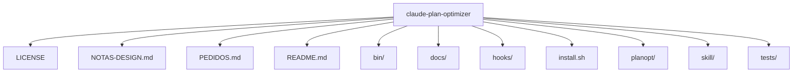

# Estrutura — claude-plan-optimizer

## Pastas de topo

```
claude-plan-optimizer/
├── LICENSE
├── NOTAS-DESIGN.md
├── PEDIDOS.md
├── README.md
├── bin/
├── docs/
├── hooks/
├── install.sh
├── planopt/
├── skill/
├── tests/
```

## Diagrama



## Componentes / módulos importantes

_Sem pastas de módulo padrão detectadas._
